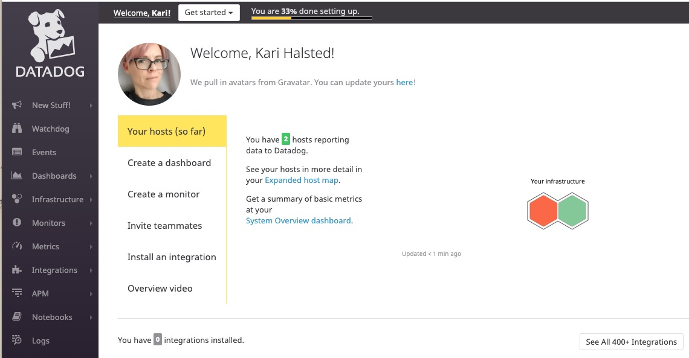
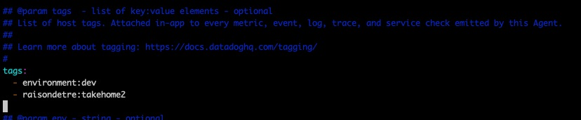
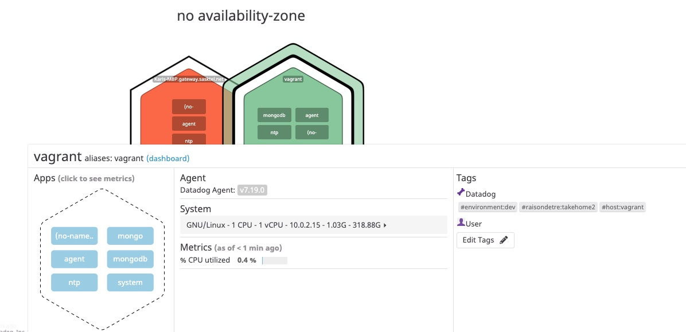
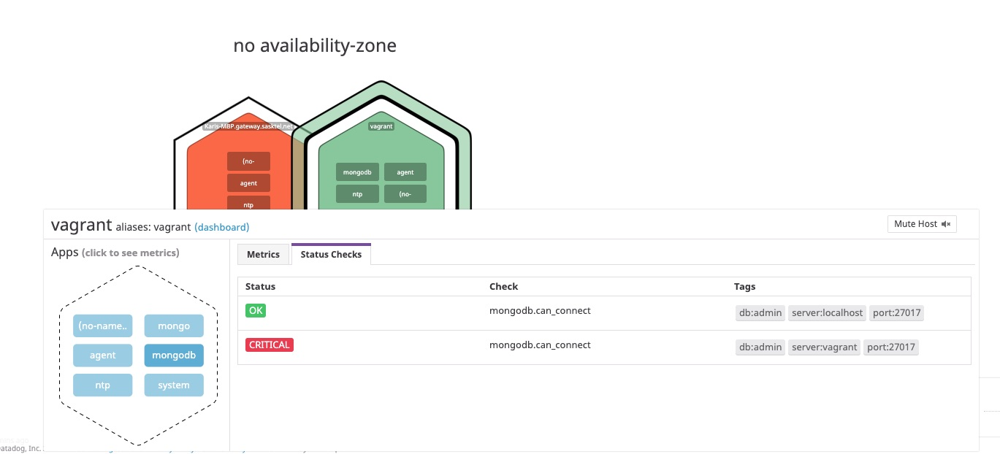
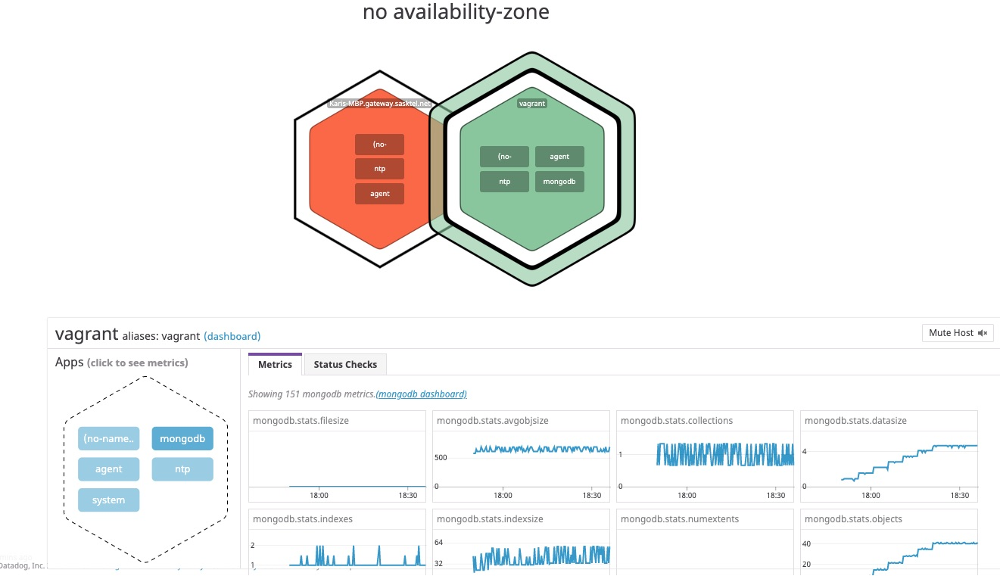
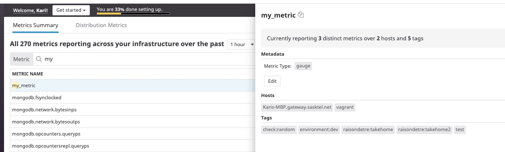
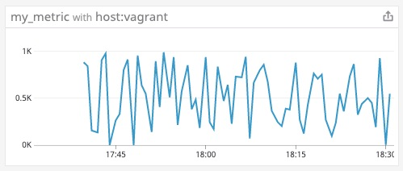
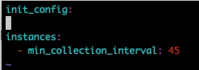
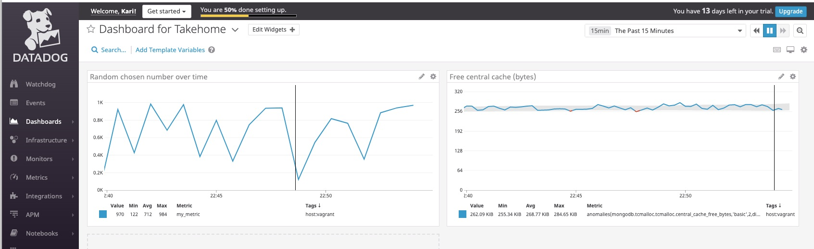
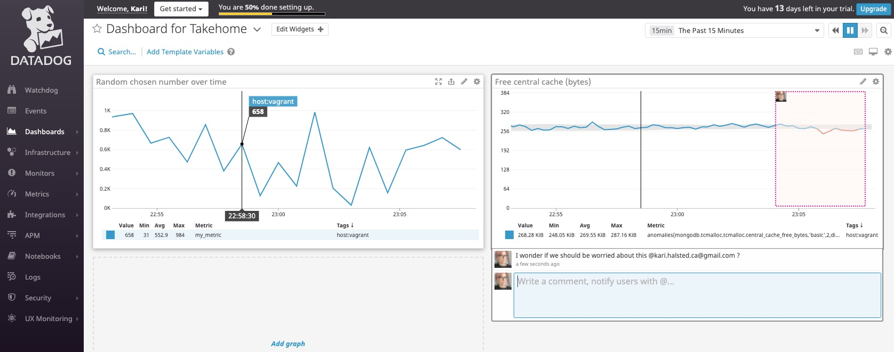

# Kari's answers

## Setting up the environment

I set up a Vagrant Ubuntu VM. This turned out to be very handy because part way through the exercise, things went sideways, and I had to tear it down and start up a new one. Some evidence of that appears in my screen caps.

I set up my DataDog account and installed agents on the Ubuntu host (green in the host map) and my local machine (orange). The local machine agent was useful for trying things out and comparing, but what I report about here is all on the Vagrant Ubuntu host.

## Collecting metrics

On the Ubuntu host, I edited the file `/etc/datadog-agent/datadog.yaml` to add tags:

In a few moments, the tags showed up in the Host Map:

> **Note:** The `mongo`, `mongodb`, and `no-namespace` Apps that appear on this host are data collection from the earlier instance of the Vagrant VM with the same hostname (`vagrant`). At this stage I have not installed MongoDB or the custom Agent check on this Ubuntu host. 

I installed MongoDB on the Ubuntu host, and installed and configured the Datadog MongoDB integration. Here, you can see the Agent connection status:

And here are the metrics the Agent is collecting:

I created a custom Agent check to report a random number metric called `my_metric`. It has the following parts:
* `/etc/datadog-agent/checks.d/custom_randomcheck.py` ([script example here](./custom_randomcheck.py))
* `/etc/datadog-agent/conf.d/custom_randomcheck.d/custom_randomcheck.yaml` ([config example here](./custom_randomcheck.yaml))
In the config file, I configured the script to report the metric every 45 seconds. 

In the Metrics Summary, it looked like this:

And the graph for it looked like this:

> **Bonus question:** I set the minimum time between metric collection to 45 seconds, rather than the default 15, by setting the `min_collection_interval` parameter in the `custom_randomcheck.yaml` file (not in the Python file).
> 
> 

## Visualizing data

I wrote a Python script that creates an ordered dashboard (previously called a timeboard) that shows:
* the `my_metric` data collected from my Ubuntu host for the custom Agent check `custom_randomcheck`, and
* the data for a metric `central_cache_free_bytes` from MongoDB.

The MongoDB metric has an anomalies function applied, so the graph shows a gray band indicating two standard deviations of the metric. When the free cache gets too far below the norm, that's a potential concern to me, so the graph makes that line red.

The code for the dashboard is here: [`takehome_timeboard.py`](./takehome_timeboard.py). Embarrassingly, I published my keys when I committed this to GitHub. A helpful Zendesk ticket from Datadog support reminded me to revoke and create new ones, which I have done.

Here's what the dashboard looks like in the Datadog UI, scoped to 15 minutes and graph size Large:

While it's still up, you can see the public dashboard here: [Dashboard for Takehome](https://p.datadoghq.com/sb/y6r846j0luxblc8k-4f2821e963b9a67a6f34b76f43d160e0)

I took a snapshot of the graph, and sent it to myself using an @-mention, which sent me an email notification.

> **Bonus question:** The anomaly graph shows not only the value of the `central_cache_free_bytes` over time, but also a gray band representing the historical range for the metric within (in this case) two standard deviations above and below. The gray band indicates where Datadog predicts the metric will be, given past behavior (based on a Basic algorithm). When the actual metric is outside the grey band, particularly _below_ since this is an available cache metric, it means it's outside the predicted range. The red line emphasizes that this could be a problem, and I could set up an [Anomaly monitor](https://docs.datadoghq.com/monitors/monitor_types/anomaly/) to provide alerts for prolonged anomalous behavior.

## Final question

See my [blog post](./blog_post.md).
